# ⚡ Currents

A modern, multi-platform news app built with **Kotlin Multiplatform** and **Compose Multiplatform** — running natively on Android, iOS, Wear OS, and Android Auto from a single shared codebase.

> Built as a portfolio project to demonstrate production-grade KMP architecture, Clean Architecture, and multi-platform UI development.

---

## 📱 Screenshots

### Android
| Home | Explore | Search |
|------|---------|--------|
| 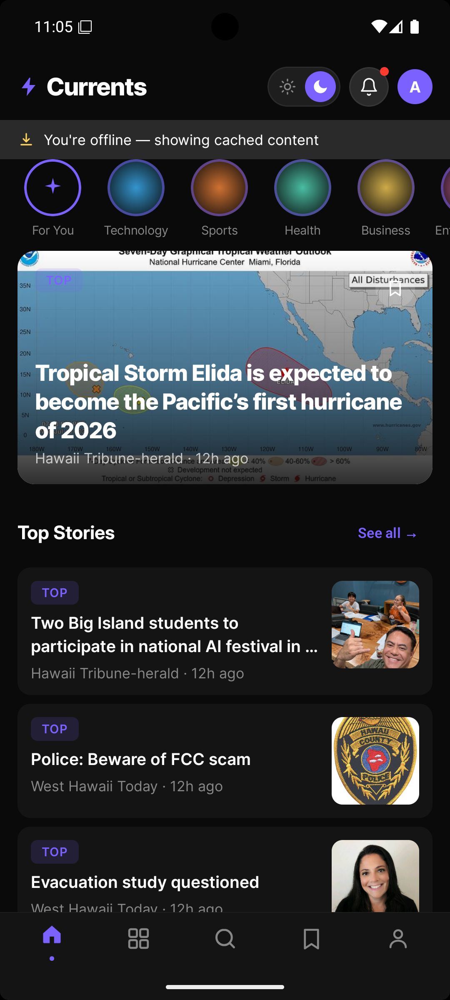 | 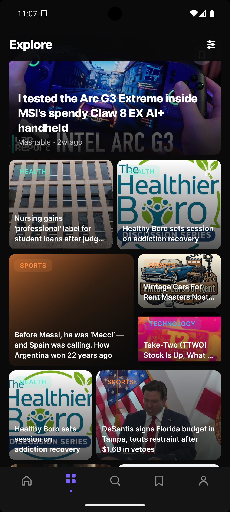 | 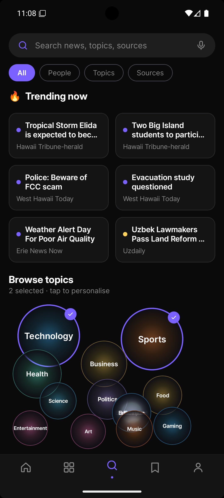 |

| Bookmarks | Article Detail | Profile |
|-----------|----------------|---------|
| 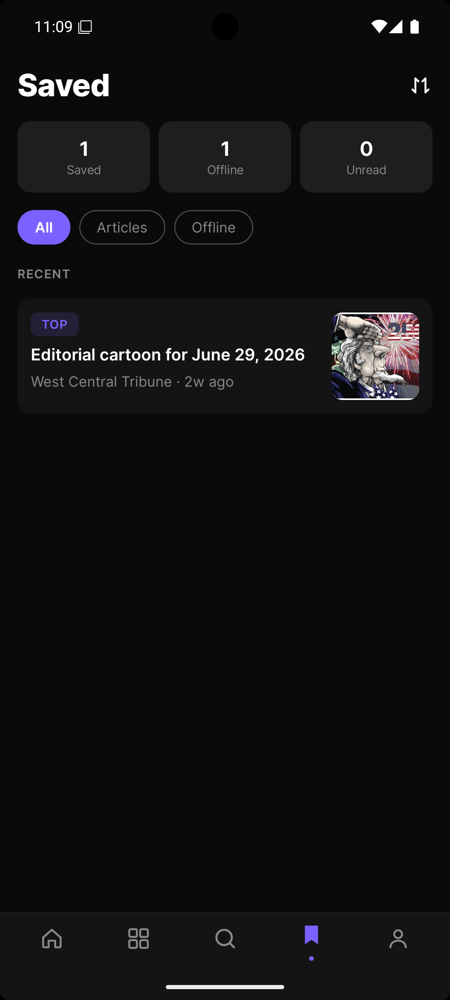 | 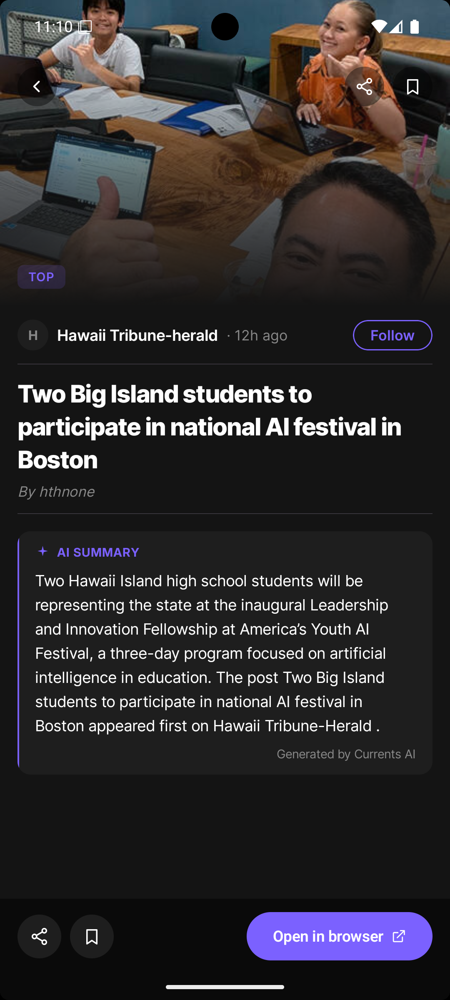 | 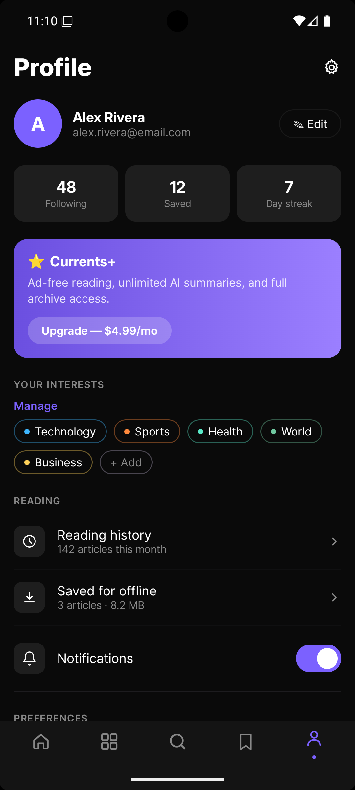 |

### iOS
| Home | Explore | Search |
|------|---------|--------|
| 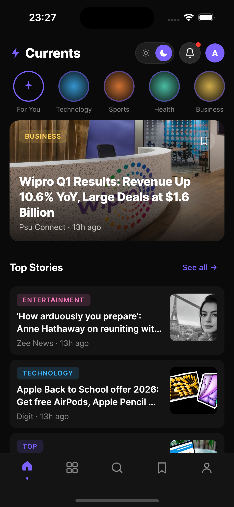 | 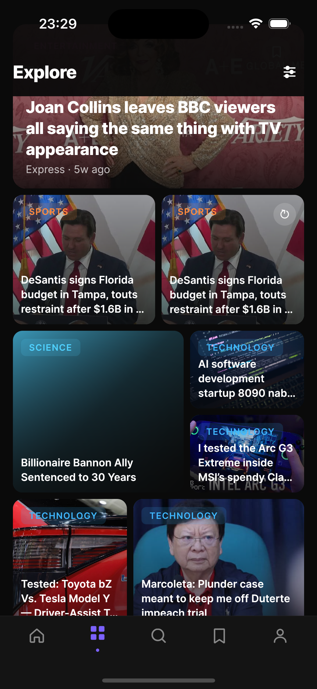 |  |


| Bookmarks                                       | Article Detail                              | Profile                                     |
|-------------------------------------------------|---------------------------------------------|---------------------------------------------|
| 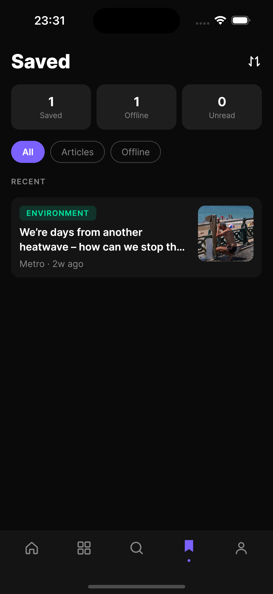 |  | 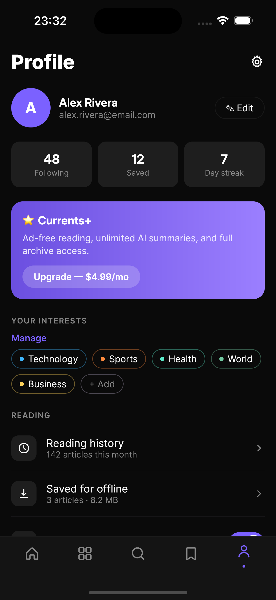 |


### Wear OS
| Feed | Article + TTS |
|------|---------------|
| 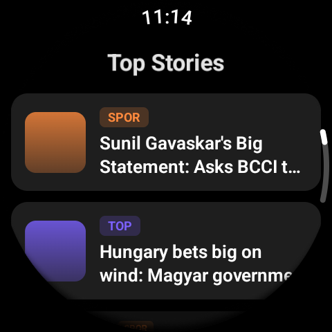 | 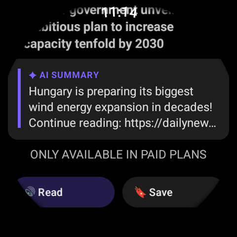 |

---

## 🏗 Architecture

Currents follows **Clean Architecture** with a strict separation of concerns across three layers:

```
┌─────────────────────────────────────────────────────────────┐
│                        UI Layer                             │
│  Compose Multiplatform · MVI · StateFlow · ViewModels       │
│  Android · iOS · Wear OS · Android Auto                     │
├─────────────────────────────────────────────────────────────┤
│                      Domain Layer                           │
│  Use Cases · Repository Interfaces · Domain Models          │
│  Pure Kotlin · No Android/iOS dependencies                  │
├─────────────────────────────────────────────────────────────┤
│                       Data Layer                            │
│  Ktor (network) · SQLDelight (local) · DataStore (prefs)    │
│  Repository Implementations · DTOs · Mappers               │
└─────────────────────────────────────────────────────────────┘
```

### Module Structure

```
Currents/
├── shared/                          # KMP shared module
│   └── src/
│       ├── commonMain/              # Shared across all platforms
│       │   ├── domain/
│       │   │   ├── model/           # Article, Category
│       │   │   ├── repository/      # Repository interfaces
│       │   │   └── usecase/         # GetFeed, Search, Bookmark...
│       │   ├── data/
│       │   │   ├── remote/          # Ktor + NewsData API
│       │   │   ├── local/           # SQLDelight database
│       │   │   └── repository/      # Repository implementations
│       │   ├── presentation/        # ViewModels + MVI contracts
│       │   │   ├── base/            # BaseViewModel<S,E,F>
│       │   │   ├── home/
│       │   │   ├── explore/
│       │   │   ├── search/
│       │   │   ├── bookmarks/
│       │   │   ├── profile/
│       │   │   └── article/
│       │   └── ui/                  # Compose screens + components
│       ├── androidMain/             # Android-specific implementations
│       └── iosMain/                 # iOS-specific implementations
├── androidApp/                      # Android entry point + Auto
│   └── auto/                        # Android Auto (CarAppService)
├── wearApp/                         # Wear OS app
└── iosApp/                          # iOS entry point
```

### MVI Pattern

Every screen follows a consistent **Model-View-Intent** pattern via `BaseViewModel`:

```kotlin
abstract class BaseViewModel<S : UiState, E : UiEvent, F : UiEffect>(
    initialState: S,
) : ViewModel() {
    val uiState: StateFlow<S>
    val effect: Flow<F>
    protected fun setState(reducer: S.() -> S)
    protected fun sendEffect(effect: F)
    abstract fun onEvent(event: E)
}
```

---

## 🛠 Tech Stack

### Core
| Technology | Usage |
|-----------|-------|
| [Kotlin Multiplatform](https://kotlinlang.org/docs/multiplatform.html) | Shared business logic across Android + iOS |
| [Compose Multiplatform](https://www.jetbrains.com/lp/compose-multiplatform/) | Shared UI across Android + iOS |
| [Kotlin Coroutines + Flow](https://kotlinlang.org/docs/coroutines-overview.html) | Async operations + reactive state |

### Networking
| Technology | Usage |
|-----------|-------|
| [Ktor](https://ktor.io/) | HTTP client (KMP-compatible) |
| [kotlinx.serialization](https://github.com/Kotlin/kotlinx.serialization) | JSON parsing |
| [NewsData.io API](https://newsdata.io/) | News data source |

### Local Storage
| Technology | Usage |
|-----------|-------|
| [SQLDelight](https://cashapp.github.io/sqldelight/) | Type-safe SQL database (KMP) |
| [DataStore](https://developer.android.com/topic/libraries/architecture/datastore) | User preferences (onboarding, settings) |

### DI + Image Loading
| Technology | Usage |
|-----------|-------|
| [Koin](https://insert-koin.io/) | Dependency injection (KMP-compatible) |
| [Coil 3](https://coil-kt.github.io/coil/) | Image loading (KMP-compatible) |

### Multi-Platform Targets
| Platform | Technology |
|----------|-----------|
| Android | Jetpack Compose · Material 3 |
| iOS | Compose Multiplatform |
| Wear OS | Wear Compose · ScalingLazyColumn · SwipeDismissableNavHost |
| Android Auto | Car App Library · ListTemplate · LongMessageTemplate · TTS |

---

## ✨ Features

### 📰 News Feed
- Real-time news from NewsData.io API
- Breaking news banner with live indicator
- Category filtering (Technology, Sports, Health, Business, and more)
- Pull-to-refresh
- Offline support — cached articles available without internet

### 🔍 Search
- Debounced search (300ms) — searches as you type
- Scope tabs: All, People, Topics, Sources
- Trending now section — real articles from API
- Browse topics bubble cloud — tap to personalise your feed

### 🔖 Bookmarks
- Save articles for offline reading
- Swipe to delete
- Stats — saved count, offline count, unread count
- Section headers — Recent / Older

### 📖 Article Detail
- Hero image with gradient overlay
- AI summary powered by **Claude (claude-haiku-4-5)** — summarises article in 2-3 sentences
- Full article content
- Share + bookmark actions
- Open in browser

### 👤 Profile
- Currents+ upgrade card
- Interest management — topic bubbles
- Appearance toggle (dark/light mode)
- Reading history, offline storage stats
- Notifications toggle

### ⌚ Wear OS
- Top stories feed — ScalingLazyColumn
- Article summary screen
- **TTS — reads articles aloud through watch speaker**
- Bookmark from watch
- SwipeDismissableNavHost navigation

### 🚗 Android Auto
- Headlines list — ListTemplate
- Article detail — LongMessageTemplate
- **TTS — reads articles aloud through car speakers**
- Proper audio focus management

---

## 🤖 AI Integration

Currents uses the **Anthropic Claude API** (claude-haiku-4-5) to generate article summaries:

```kotlin
val response = client.post("https://api.anthropic.com/v1/messages") {
    header("x-api-key", appConfig.claudeApiKey)
    header("anthropic-version", "2023-06-01")
    setBody(ClaudeRequest(
        model = "claude-haiku-4-5-20251001",
        max_tokens = 200,
        messages = listOf(
            ClaudeMessage(role = "user", content = "Summarize: ${article.title}...")
        )
    ))
}
```

---

## 🚀 Getting Started

### Prerequisites
- Android Studio Hedgehog or later
- Xcode 15+ (for iOS)
- JDK 11+

### API Keys
Create a `local.properties` file in the root directory:

```properties
NEWS_API_KEY=your_newsdata_io_api_key
CLAUDE_API_KEY=your_anthropic_api_key
```

Get your keys:
- NewsData.io: [newsdata.io](https://newsdata.io) — free tier available
- Anthropic: [console.anthropic.com](https://console.anthropic.com)

### Run Android
```bash
./gradlew :androidApp:installDebug
```

### Run iOS
```bash
cd iosApp
open iosApp.xcodeproj
# Build and run in Xcode
```

### Run Wear OS
```bash
./gradlew :wearApp:installDebug
# Deploy to Wear OS emulator or device
```

---

## 🧪 Tests

Unit tests cover the core domain layer use cases:

```bash
./gradlew :shared:test
```

Tests cover:
- `GetFeedUseCase` — cache-first strategy, remote fallback
- `SearchArticlesUseCase` — query delegation, error handling
- `AddBookmarkUseCase` / `RemoveBookmarkUseCase` / `GetBookmarksUseCase`
- `IsBookmarkedUseCase`

---


## 👨‍💻 Author

**Toluwalope Ayodele**
- GitHub: [@toluwalope19](https://github.com/toluwalope19)
- LinkedIn: [linkedin.com/in/ayodelepathfinder](https://linkedin.com/in/ayodelepathfinder)

---

## 📄 License

```
MIT License — feel free to use this as a reference or starting point.
```